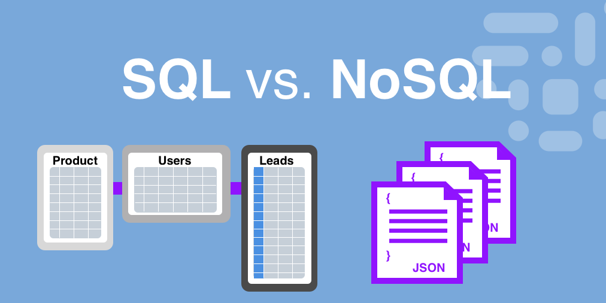
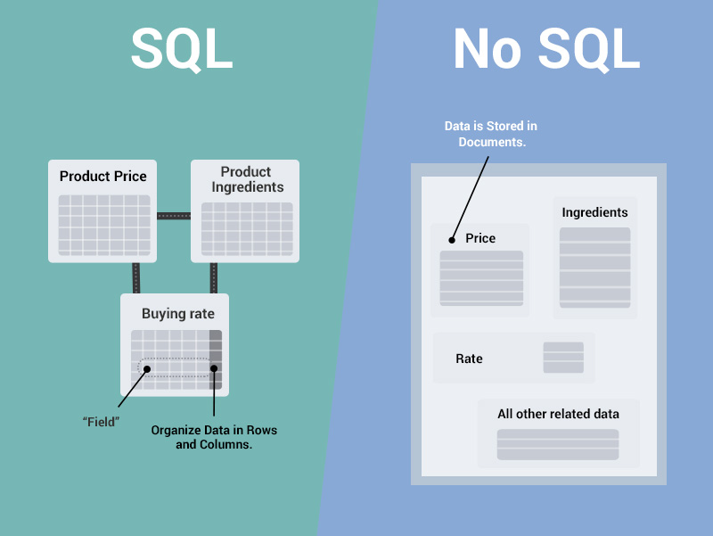

# 관계형 / 비관계형 DB

관계형 DB 예시) MySQL, 

비관계형DB 예시) MongoDB, ...

## SQL

Structured Query Language의 약자로 SQL 사용시 RDBMS에서 data를 저장 수정 삭제 및 검색할 수 있음

엄격한 데이터 스키마(structure)를 따라 DB table에 저장됨.

데이터는 관계를 통해 연결된 여러 table에 분산됨

각 table들은 서로 다른 table에 저장되지 않은 data 만을 가지고 있음

application의 여러 부분에서 관련 데이터가 비교적 자주 변경되는 경우 유리함

명확한 스키마가 중요하고 data구조가 크게 변경되지 않을 때 유리함

***<장점>***

명확하게 정의된 스키마, 데이터의 무결성 보장

관계를 통해 각 데이터 중복 없이 한 번만 저장할 수 있음

***<단점>***

덜 유연 → 데이터 스키마 미리 알고 계획해야 함

JOIN문이 많은 매우 복잡한 쿼리가 만들어 질 가능성

보통 수직확장만 가능(수평 확장 어려움)

## NoSQL

스키마 없음, 관계 없음

table을 *collection*으로 record를 *documents*라고 부름

복잡한 JOIN문으로 작업할 필요가 없다는 것이 장점(필요한 모든 데이터가 이미 저장되어 있음)

읽기 처리는 자주하지만 자주 바뀌지 않는 data일 때 유리함

정확한 data 요구사항 알 수 없거나 관계를 맺고 있는 데이터가 자주 변경(수정)되는 경우에 유리함

수평확장을 해야하는 경우(= 막대한 양의 data 다뤄야하는 경우, 읽기/쓰기 처리량 큰 경우)

***<장점>***

스키마가 없으므로 유연성 높음 → 언제든지 새로운 "필드" 추가 가능

application에 필요한 형식으로 데이터 저장 → 가져오는 속도 빨라짐

수직,수평 확장이 가능하므려 DB가 application에서 발생시키는 모든 읽기/쓰기 요청 처리 가능

***<단점>***

유연성 떄문에 데이터 구조 결정이 늦어질 수 있음

복사된 data 변경 시 여러 collection과 document 수정해야 함

### 수직확장(vertical)과 수평확장(horizontal)

수직확장: 단순히 DB 서버성능을 향상시키는 것. ex) CPU 업그레이드

수평확장: 더 많은 서버 추가, DB가 분산되는 것. 하나의 DB에서 작동하지만 여러 host에서 작동

